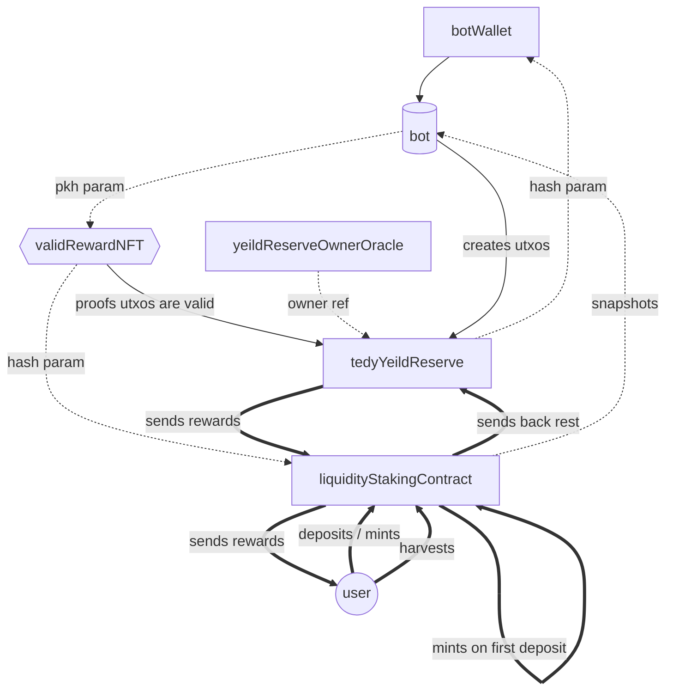

# teddyswap lp tokens staking contracts


## contracts interactions 



## Local testing procedure

### Prerequisites

on your local environment you should have a private testnet running with a project structure similar to the one you can find in the [`woofpool/cardano-private-testnet-setup` repository](https://github.com/woofpool/cardano-private-testnet-setup)

then in this directory you need to create an `.env` file specifying a `PRIVATE_TESTNET_PATH` environment variable specifiyng the path to the `private-testnet` folder as follows.
```
PRIVATE_TESTNET_PATH="path/to/cardano-private-testnet-setup/private-testnet"
```

### run the `setup` script if in private tesnet

```bash
npm run yeild:setup
```

### compiling the contracts

```bash
npm run yeild:compile
```

### initialize the `yeildReserveOwner` oracle contract

```bash
npm run yeild:initOwnerOracle
```

### mint some `fakeTEDY`s

```bash
npm run yeild:mintFakeTedy (epoch_index) [mint_amount]
```

### create a stake account

```bash
npm run yeild:firstStake
```